# Marco 1 — Co-processador ELM

<p align="center">
  <a href="README.md">
    
  </a>
  &nbsp;
  <a href="MARCO2.md">
    
    
  </a>
  &nbsp;
  <a href="MARCO3.md">
    
    
  </a>
</p>

---

## Sumário

1. [Descrição do Projeto](#descrição-do-projeto)
2. [Fluxo de Inferência](#fluxo-de-inferência)
3. [Representação Numérica — Ponto Fixo Q4.12](#representação-numérica--ponto-fixo-q412)
4. [Estrutura do Repositório](#-estrutura-do-repositório)
5. [Arquitetura do Co-processador](#arquitetura-do-co-processador-rtl-viewer-quartus)
6. [Máquina de Estados (FSM)](#máquina-de-estados-fsm)
7. [Hardware Utilizado](#hardware-utilizado)
8. [Interface com a placa DE1-SoC](#interface-com-a-placa-de1-soc)
9. [Softwares Utilizados](#softwares-utilizados)
10. [Instalação e Configuração do Ambiente](#instalação-e-configuração-do-ambiente)
11. [Execução dos Testes de Simulação](#execução-dos-testes-de-simulação)
12. [Análise dos Resultados](#análise-dos-resultados)

---

## Descrição do Projeto

Este projeto implementa um classificador de dígitos MNIST em hardware reconfigurável (FPGA), utilizando uma rede neural do tipo Extreme Learning Machine (ELM). Toda a inferência — da leitura da imagem até a predição do dígito — ocorre diretamente no chip, sem auxílio de CPU.

### Por que ELM?

- **Estrutura simples**: camada oculta com pesos aleatórios fixos e somente a camada de saída é treinada, dispensando retropropagação em hardware
- **Baixa latência**: número reduzido de operações por inferência em comparação a CNNs
- **Adequada para ponto fixo**: operações lineares e função de ativação simples mapeiam bem em Q4.12

---

## Fluxo de Inferência

A ELM opera em quatro estágios sequenciais:

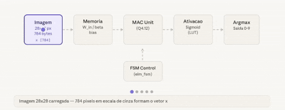

---

## Representação Numérica — Ponto Fixo Q4.12

[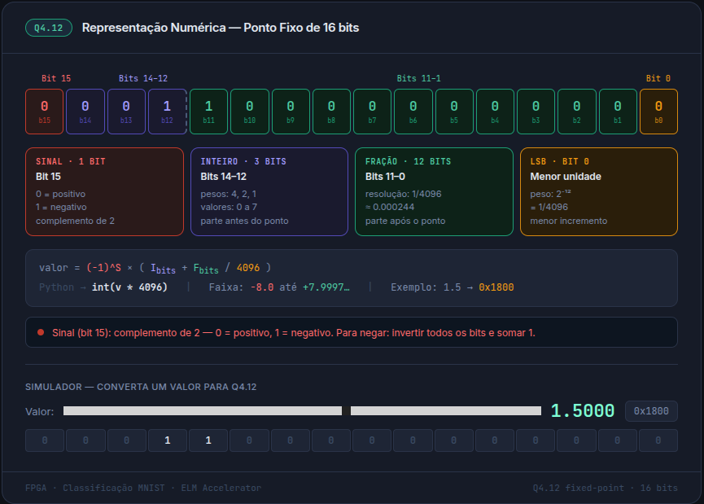](https://rogeriocerqueira.github.io/classificacao_de_digitos_numericos_MNIST/gitimages/q412.html)

> Converter um valor real `v` para Q4.12: `int(v * 4096)`

| Parâmetro | Dimensão  | Arquivo de inicialização |
|-----------|-----------|--------------------------|
| `W_in`    | 128 × 784 | `W_in_q.mif`             |
| `b`       | 128 × 1   | `b_q.mif`                |
| `β`       | 10 × 128  | `beta_q.mif`             |
| `x`       | 784 × 1   | `png.mif`                |

Todos os valores são representados em **ponto fixo Q4.12** (1 bit de sinal + 3 bits inteiros + 12 bits fracionários, resolução ≈ 0,000244).

---

## 📁 Estrutura do Repositório

```bash
.
├── elm_accel/               # Módulos RTL principais
│   ├── elm_accel_core.v     # Coordena MAC, memória e ativação
│   ├── mac.v                # Unidade Multiplica-Acumula (Q4.12)
│   ├── fsm.v                # Controlador de estados da inferência
│   ├── tanh_lut.v           # Função de ativação tanh aproximada (LUT)
│   ├── argmax.v             # Converte saídas da rede em resultado discreto
│   ├── ram_image.qip        # RAM-1-Port (Word:784 × 16-bits)
│   ├── ram_w_in.qip         # RAM-1-Port (Word:100352 × 16-bits)
│   ├── ram_bias.qip         # RAM-1-Port (Word:128 × 16-bits)
│   ├── ram_beta.qip         # RAM-1-Port (Word:7841 × 16-bits)
│   └── ram_h.qip            # RAM-1-Port (Word:128 × 16-bits)
├── sim/                     # Arquivos de simulação
│   └── elm_accel_tb.v       # Testbench com imagens MNIST
├── state_management/        # Controle e monitoramento de estado
├── scripts/
│   └── run_all.do           # Executa todos os testbenches no Questa
├── gitimages/
│   ├── mnist_png/           # Imagens MNIST de teste (.png)
│   └── testbench/           # Capturas da simulação no Questa
├── docs/                    # Diagramas, prints e documentação
└── README.md
```

#### Dependências entre Módulos

```
elm_top (top-level)
├── fsm.v          ──▶ controla sinais de enable/reset
├── datapath.v
│   ├── mac.v      ──▶ operação de produto escalar Q4.12
│   └── memory.v   ──▶ fornece pesos e pixels ao MAC
```

#### Descrição dos Módulos

| Arquivo                    | Módulo              | Responsabilidade                                           |
|----------------------------|---------------------|------------------------------------------------------------|
| `elm_accel/elm_accel.v`    | `elm_accel`         | Top-level — orquestra o fluxo de dados entre MAC e memória |
| `elm_accel/mac.v`          | `mac`               | Multiplica dois operandos Q4.12 e acumula resultado        |
| `elm_accel/tanh_lut.v`     | `tanh_lut`          | Aplica a função piecewise linear                           |
| `elm_accel/display_7seg.v` | `display_7seg`      | Exibe o dígito resultado da inferência                     |
| `elm_accel/fsm.v`          | `elm_fsm`           | Gera sinais de controle conforme estado atual              |
| `elm_accel/memories.v`     | `memories`          | ROM/RAM para imagem, pesos W_in, bias e β                  |
| `sim/elm_accel_tb_real.v`  | `elm_accel_tb_real` | Aplica os testes de todos os módulos                       |

#### Uso de Memória (M10K)

| RAM         | Profundidade | Largura | Bits          | Tipo             |
|-------------|-------------|---------|---------------|------------------|
| `ram_w_in`  | 100.352     | 16-bit  | 1.605.632     | M10K Single Port |
| `ram_beta`  | 1.280       | 16-bit  | 20.480        | M10K Single Port |
| `ram_bias`  | 128         | 16-bit  | 2.048         | M10K Single Port |
| `ram_h`     | 128         | 16-bit  | 2.048         | M10K Auto        |
| `ram_image` | 784         | 16-bit  | 12.544        | M10K Dual Port   |
| **Total**   |             |         | **1.642.752** |                  |

---

## Arquitetura do Co-processador (RTL Viewer Quartus)

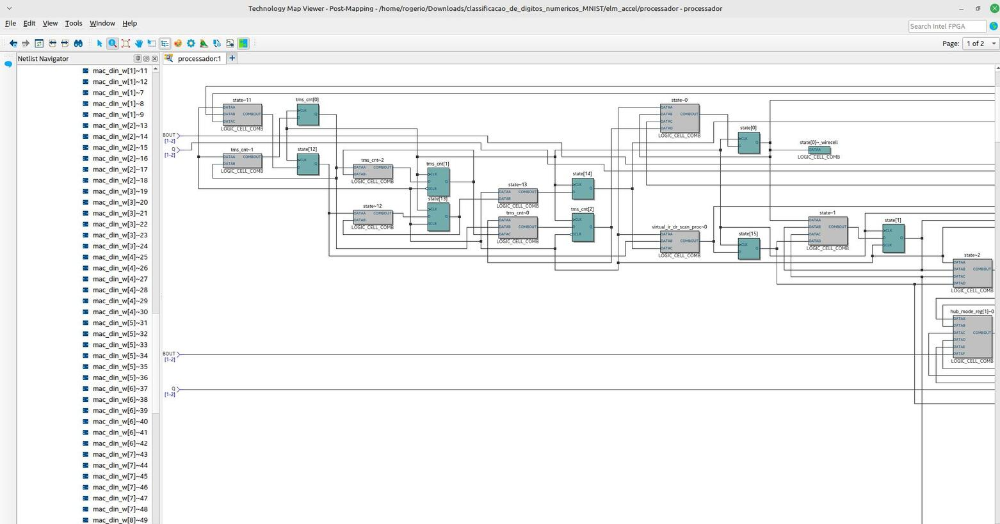

<table>
  <tr>
    <td align="center" width="50%">
      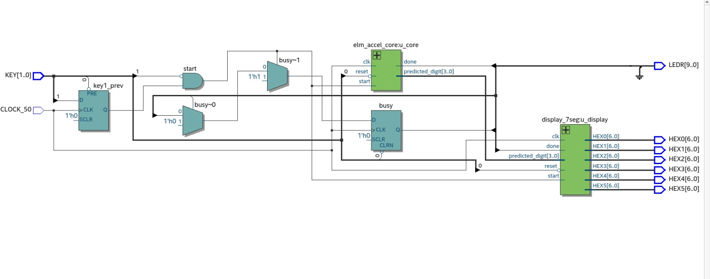
      <br/>
      <sub><b>🏗️ Diagrama de Arquitetura Geral</b></sub>
    </td>
    <td align="center" width="50%">
      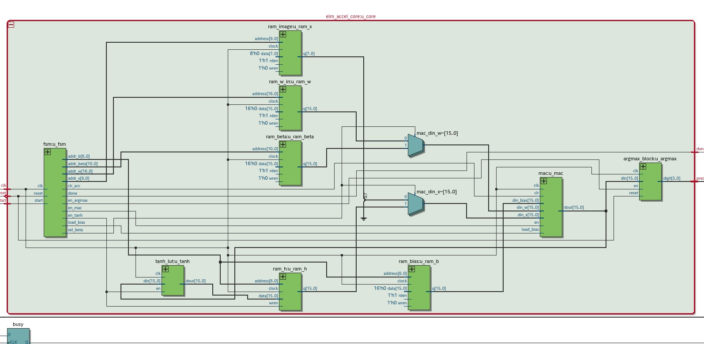
      <br/>
      <sub><b>⚙️ Core do Módulo elm_accel</b></sub>
    </td>
  </tr>
</table>

---

## Máquina de Estados (FSM)

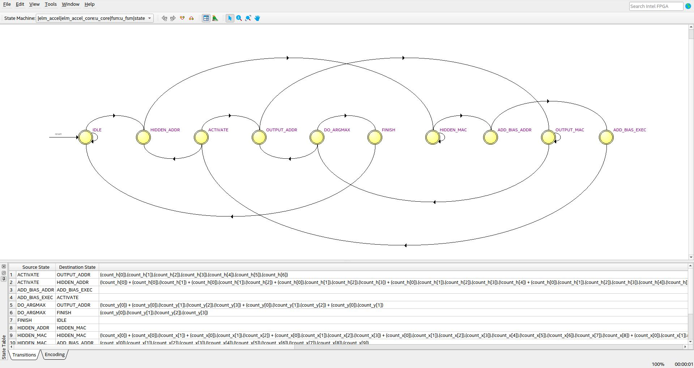

> **Diagrama gerado automaticamente pelo Quartus State Machine Viewer.**

#### Tabela de Estados

| Estado           | Descrição                                       | Transição                        |
|------------------|-------------------------------------------------|----------------------------------|
| `IDLE`           | Aguarda sinal `start`                           | `start=1` → `LOAD`              |
| `LOAD`           | Transfere os 784 pixels para a memória interna  | Contador cheio → `COMPUTE_HIDDEN`|
| `COMPUTE_HIDDEN` | Executa MAC: `h = W_in · x + b`                | MAC completo → `ACTIVATE`        |
| `ACTIVATE`       | Aplica piecewise via LUT sobre cada nó oculto   | LUT completa → `COMPUTE_OUTPUT`  |
| `COMPUTE_OUTPUT` | Calcula saída: `y = β · h`                      | MAC completo → `ARGMAX`          |
| `ARGMAX`         | Encontra índice do maior valor em `y[0..9]`     | Seleção pronta → `DONE`          |
| `DONE`           | Mantém resultado; aguarda reset ou novo `start` | `rst=1` → `IDLE`                 |

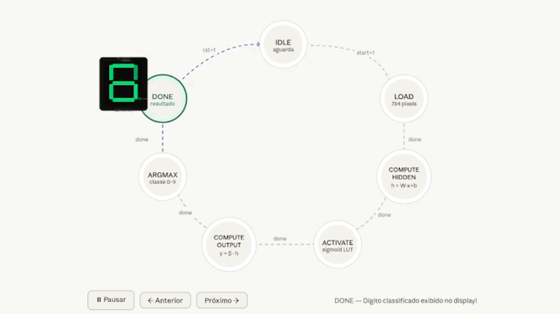

---

## Hardware Utilizado

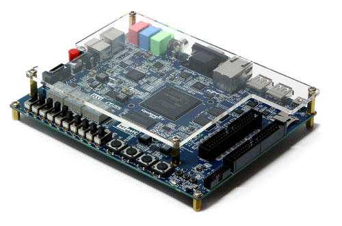

| Item                     | Especificação                               |
|--------------------------|---------------------------------------------|
| Placa de desenvolvimento | DE1-SoC — Terasic                           |
| FPGA                     | Intel Cyclone V — 5CSEMA5F31C6              |
| Elementos lógicos        | 315 ALMs                                    |
| Blocos de memória        | 1.642.752 bits (M10K)                       |
| Total Registradores      | 312                                         |
| Blocos DSP               | 86 disponíveis                              |
| Clock                    | 50 MHz (CLOCK_50)                           |
| Interface de usuário     | 2 botões KEY, 10 LEDs LEDR, 1 display HEX0 |

| Pino      | Função                                       |
|-----------|----------------------------------------------|
| `KEY[0]`  | Reset assíncrono (ativo baixo)               |
| `KEY[1]`  | Start — dispara inferência (borda de descida)|
| `HEX0`    | Dígito predito (0–9)                         |
| `LEDR[0]` | Done — acende ao concluir a inferência       |
| `LEDR[9]` | Busy — acende durante o processamento        |

---

## Interface com a placa DE1-SoC

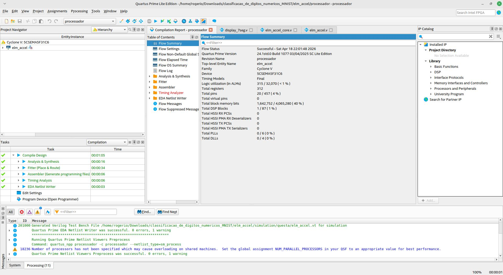

---

## Softwares Utilizados

| Software                             | Versão          | Finalidade                               |
|--------------------------------------|-----------------|------------------------------------------|
| Intel Quartus Prime Lite Edition     | 24.1std.0.1077  | Síntese, place & route, programação FPGA |
| Questa Intel Starter FPGA Edition-64 | 2024.3          | Simulação funcional RTL                  |
| Python 3                             | 3.10+           | Conversão PNG → Q4.12 (.hex/.mif)        |
| Pillow (PIL)                         | —               | Leitura de imagens PNG                   |
| NumPy                                | 1.24+           | Operações de normalização Q4.12          |
| Git                                  | —               | Controle de versão                       |

> ⚠️ Recomenda-se usar a **Quartus 24.1 Lite** para reprodução fiel dos resultados.

---

## Instalação e Configuração do Ambiente

#### 1. Clonar o repositório

```bash
git clone https://github.com/rogeriocerqueira/classificacao_de_digitos_numericos_MNIST
cd classificacao_de_digitos_numericos_MNIST
```

#### 2. Instalar dependências Python

```bash
sudo apt install python3-pil python3-numpy
```

#### 3. Gerar os arquivos `.hex` e `.mif`

```bash
python3 /caminho_para_script/convert_images.py
```

Gera automaticamente:
- `sim/0.hex` a `sim/9.hex` — para simulação no Questa
- `elm_accel/0.mif` a `elm_accel/9.mif` — para síntese no Quartus

Para selecionar qual dígito testar:

```bash
cp sim/7.hex sim/png.hex          # Simulação
cp elm_accel/7.mif elm_accel/png.mif  # Síntese (requer recompilação)
```

#### 4. Compilar no Quartus

```
1. Abrir elm_accel/processador.qpf no Quartus
2. Processing → Start Compilation
3. Aguardar compilação (~5-10 minutos)
```

#### 5. Programar a DE1-SoC

```
1. Conectar USB-Blaster
2. Tools → Programmer
3. Selecionar output_files/processador.sof
4. Start
```

#### 6. Operar na placa

```
KEY[0] → Reset (mantém pressionado e solta para iniciar)
KEY[1] → Pressionar para disparar a inferência
LEDR[9] acende → processando (~2ms a 50 MHz)
LEDR[0] acende → inferência concluída
HEX0   → exibe o dígito predito (0–9)
```

---

## Execução dos Testes de Simulação

#### Pré-requisito

```bash
cd sim/
cp 0.hex png.hex    # ou qualquer dígito desejado
wc -l png.hex       # deve mostrar 784
```

#### Rodar todos os testbenches

```tcl
Questa> cd /caminho/para/sim
Questa> do run_all.do
```

Ordem de execução:

```
1. mac_tb              — 5 testes unitários do MAC
2. tanh_lut_tb         — 7 casos da ativação
3. argmax_block_tb     — 4 testes do argmax
4. fsm_tb              — 11 testes da FSM
5. elm_accel_tb        — 12 testes de integração
6. elm_accel_tb_real   — inferência com pesos reais
```

#### Trocar imagem e re-testar

```bash
cp 3.hex png.hex
```
```tcl
Questa> do run_all.do
```

---

### Script `run_all.do` — Compilação completa

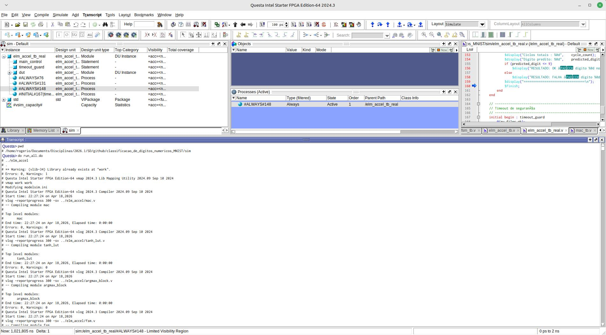

Compilação de todos os módulos RTL e testbenches sem erros.

---

### Teste do MAC Q4.12

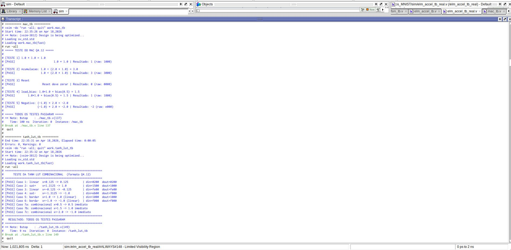

| Teste | Operação              | Resultado raw | Valor Q4.12 |
|-------|-----------------------|---------------|-------------|
| 1     | `1.0 × 1.0`           | `0x1000`      | +1.0        |
| 2     | `1.0 + (2.0 × 1.0)`   | `0x3000`      | +3.0        |
| 3     | Reset (`clr=1`)       | `0x0000`      | 0.0         |
| 4     | `1.0×1.0 + bias(0.5)` | `0x1800`      | +1.5        |
| 5     | `(-1.0) × 2.0`        | `0xE000`      | -2.0        |

O MAC mantém o acumulador em Q8.24 internamente (`acc[31:0]`) e fatia `acc[27:12]` na saída, preservando precisão durante as 784 acumulações sem truncamento intermediário. Todos os 7 casos do `tanh_lut` também passaram.

---

### Teste do argmax_block

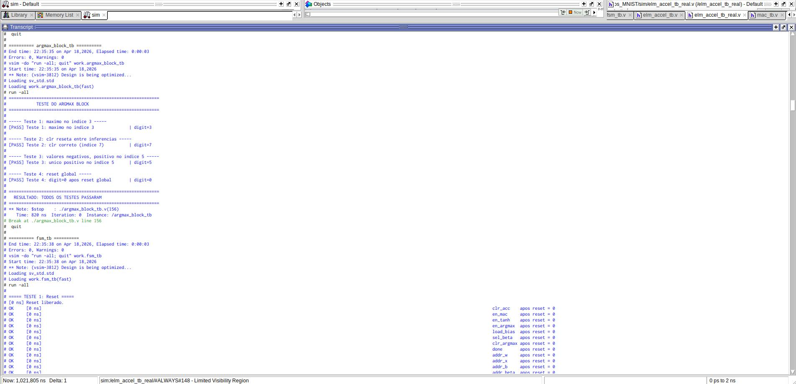
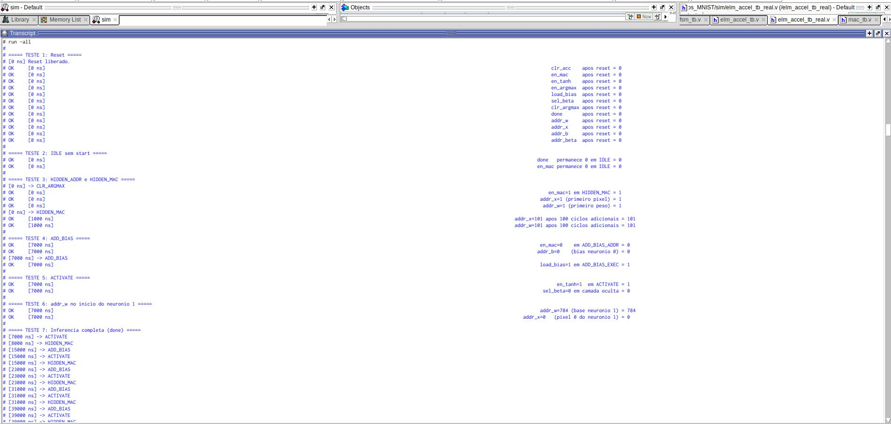
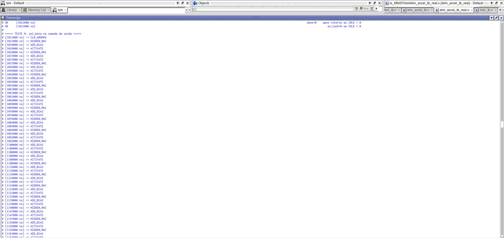
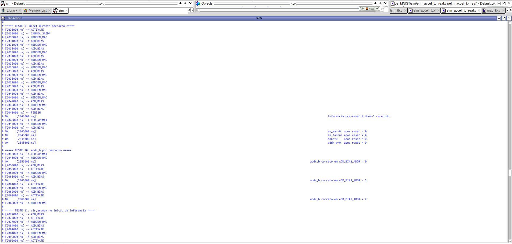

| Teste | Cenário                        | Resultado   |
|-------|--------------------------------|-------------|
| 1     | Máximo no índice 3 (`0x7000`)  | `digit=3` ✓ |
| 2     | `clr` reseta entre inferências | `digit=7` ✓ |
| 3     | Único positivo no índice 5     | `digit=5` ✓ |
| 4     | Reset global                   | `digit=0` ✓ |

O **Teste 2** valida a correção do Bug #4 — sem `clr_argmax`, `max_val` da inferência anterior persistiria e bloquearia atualizações subsequentes.

---

### Testes de integração — elm_accel_tb

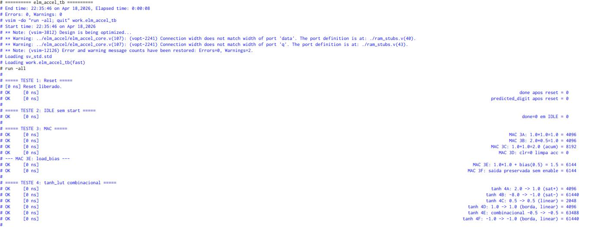
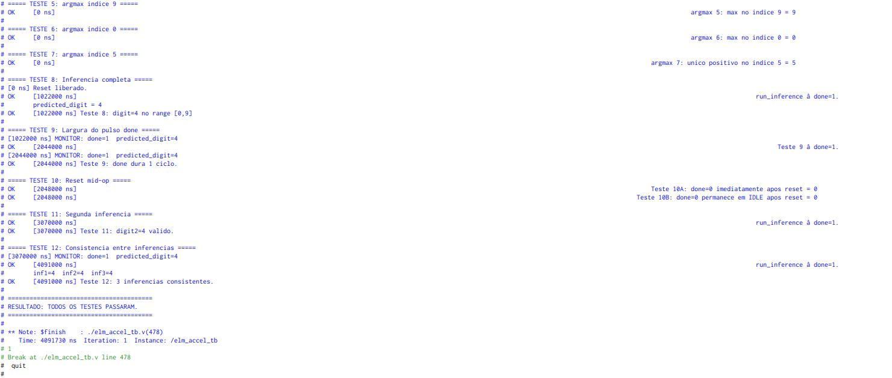

| Teste | Descrição                             | Resultado                    |
|-------|---------------------------------------|------------------------------|
| 1     | Reset — sinais inicializados          | ✓                            |
| 2     | IDLE sem start                        | ✓                            |
| 3     | MAC isolado (6 sub-testes)            | ✓                            |
| 4     | tanh_lut combinacional (6 sub-testes) | ✓                            |
| 5     | argmax — máximo no índice 9           | ✓                            |
| 6     | argmax — máximo no índice 0           | ✓                            |
| 7     | argmax — único positivo no índice 5   | ✓                            |
| 8     | Inferência completa                   | `digit=4` ✓                  |
| 9     | Pulso `done` dura 1 ciclo             | ✓                            |
| 10    | Reset durante inferência              | ✓                            |
| 11    | Segunda inferência após reset         | `digit=4` ✓                  |
| 12    | Consistência — 3 inferências          | `inf1=4, inf2=4, inf3=4` ✓   |

---

### Inferência com pesos reais — elm_accel_tb_real

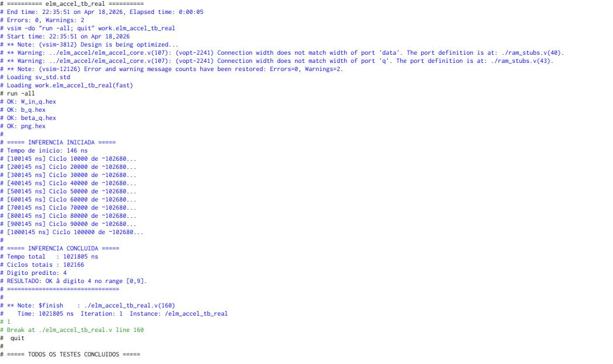

```
Arquivos verificados:  W_in_q.hex ✓  b_q.hex ✓  beta_q.hex ✓  png.hex ✓

INFERENCIA CONCLUIDA
  Tempo total   : 1.021.805 ns
  Ciclos totais : 102.166
  Dígito predito: 4
  RESULTADO: OK — dígito 4 no range [0,9]
```

| Componente        | Cálculo   | Ciclos      |
|-------------------|-----------|-------------|
| Camada oculta     | 128 × 788 | 100.864     |
| Camada de saída   | 10 × 130  | 1.300       |
| FINISH            | 1         | 1           |
| **Total teórico** |           | **102.165** |
| **Total medido**  |           | **102.166** |

Diferença de 1 ciclo dentro do pipeline da FSM — dentro do esperado.

---

## Análise dos Resultados

### Pontos fortes

- **Arquitetura modular:** separação clara entre controle (FSM) e dados (MAC, tanh, argmax)
- **Ponto fixo Q4.12:** resolução adequada sem necessidade de ponto flutuante — 0 DSPs extras
- **Acumulador Q8.24:** evita perda de precisão durante 784 multiplicações sequenciais
- **Testbenches em camadas:** 35+ casos de teste de unitário a sistema completo
- **Correção de 4 bugs críticos** identificados por análise estática antes da simulação

### Limitações conhecidas

- **Hard tanh ≠ tanh real:** a aproximação `clip(x,−1,1)` introduz erro máximo de ~31% nas bordas `x ≈ ±1`
- **Overflow silencioso no MAC:** `acc[31:28]` descartado sem tratamento
- **Imagem fixa no Marco 1:** troca requer recompilação no Quartus — resolvido no Marco 2 via MMIO
- **Sem debounce em KEY[1]:** múltiplos pulsos de `start` possíveis em acionamento rápido

### Desempenho

| Métrica               | Valor                    |
|-----------------------|--------------------------|
| Ciclos por inferência | 102.166                  |
| Tempo a 50 MHz        | ~2,04 ms                 |
| Throughput estimado   | ~490 inferências/segundo |
| Operações MAC totais  | 101.632                  |
| Ocupação de memória   | 40% dos M10K             |
| Ocupação de lógica    | < 1% dos ALMs            |

### Acurácia por Dígito

| Dígito    | Amostras | Correto | Acurácia  |
|-----------|----------|---------|-----------|
| 0         | 10       | 10      | 100%      |
| 1         | 10       | 0       | 0%        |
| 2         | 10       | 1       | 1%        |
| 3         | 10       | —       | —         |
| 4         | 10       | 10      | 100%      |
| 5         | 10       | 0       | 0%        |
| 6         | 10       | 1       | 1%        |
| 7         | 10       | —       | —         |
| 8         | 10       | —       | —         |
| 9         | 10       | —       | —         |
| **Total** | 100      | 22      | **20,2%** |

> *Valores indicados com — não foram testados neste marco.*

---

<p align="center">
  <a href="README.md">← Início</a> &nbsp;|&nbsp; <a href="MARCO2.md">Marco 2 →</a>
</p>
