# Marco 3: Aplicação C + Validação

<p align="center">
  <a href="MARCO1.md">
    
    
  </a>
  &nbsp;
  <a href="MARCO2.md">
    
    
  </a>
  &nbsp;
  <a href="README.md">
    
  </a>
</p>

---

## Objetivo

Construir a camada de software que integra o co-processador ELM (Marco 1) e o driver Assembly (Marco 2) em uma aplicação C nativa rodando no HPS (ARM Cortex-A9) da DE1-SoC, com saída de vídeo VGA, entrada por mouse e benchmark sobre o dataset MNIST.

---

## Arquitetura

```
Usuário (terminal / mouse / VGA)
         │
         ▼
      main.c  ──  elm_init_weights()  ──►  libelm.a (Marco 2)
         │                                       │
         ├── modo_arquivo.c                      ▼
         ├── modo_desenho.c            Co-processador ELM (FPGA)
         └── modo_benchmark.c          via Lightweight HPS-to-FPGA Bridge
                   │
              vga.c / mouse.c
         (acesso direto a /dev/mem — PIOs MMIO)
```

Os 7 PIOs criados no Platform Designer conectam o HPS à FPGA:

| PIO | Endereço | Função |
|-----|----------|--------|
| `data_in` | `0xFF200000` | HPS escreve instrução ao co-processador |
| `data_out` | `0xFF200010` | Co-processador retorna resultado + flags (DONE/BUSY/ERROR/pred) |
| `ctrl` | `0xFF200020` | ENABLE / CLR_OP / RESET |
| `vga_addr` | `0xFF200070` | Índice do pixel no framebuffer (0–783) |
| `vga_color` | `0xFF200080` | Cor RRRGGGBB (9 bits) |
| `vga_ctrl` | `0xFF200090` | ENABLE / WRITE_EN / RST |
| `vga_status` | `0xFF2000A0` | DONE do framebuffer |

---

## Comunicação com o Marco 2 — `libelm.a`

Todo acesso ao co-processador ELM passa pela `libelm.a`, a biblioteca estática compilada no Marco 2. O Marco 3 nunca acessa os PIOs diretamente — ele chama as funções da API do driver, que internamente executam as operações MMIO via `elm_exec.S` (Assembly ARMv7).

### Funções da API usadas pelo Marco 3

| Função | Arquivo (Marco 2) | O que faz |
|--------|-------------------|-----------|
| `elm_open(elm)` | `elm.c` | Abre `/dev/mem`, faz `mmap` da bridge, inicializa ponteiros para os PIOs |
| `elm_close(elm)` | `elm.c` | Desfaz o `mmap` e fecha o descritor |
| `elm_reset(elm)` | `elm.c` | Pulsa `ELM_SIG_RESET` + `ELM_SIG_CLR_OP` no PIO `ctrl` — zera FSM e acumuladores |
| `elm_load_weights(elm, W)` | `elm.c` | Envia 100.352 valores Q4.12 ao co-processador via 100.352 chamadas a `elm_exec.S` |
| `elm_load_biases(elm, b)` | `elm.c` | Envia 128 valores de bias |
| `elm_load_betas(elm, beta)` | `elm.c` | Envia 1.280 valores beta (transpõe output-major → hidden-major internamente) |
| `elm_classify(elm, img, pred)` | `elm.c` | Chama `elm_load_image()` (784 STORE_IMG) + `elm_start()` (START) e lê `data_out[3:0]` |

### Handshake MMIO — `elm_exec.S`

Cada chamada a `elm_exec.S` executa **uma instrução** no co-processador seguindo o protocolo:

```
1. Espera BUSY=0  →  data_out[5] == 0
2. Limpa erro     →  se data_out[6]=ERROR, pulsa CLR_OP no ctrl
3. Escreve data_in  +  DSB sy  (barreira de memória — garante ordem na bridge)
4. Sobe ENABLE    →  ctrl[0] = 1
5. Polling DONE   →  data_out[4] == 1  ou  ERROR
6. Abaixa ENABLE  →  ctrl = 0
7. Espera BUSY=0  →  garante que a FPGA finalizou
```

O `DSB sy` na etapa 3 é crítico: sem ele, a Lightweight Bridge pode reordenar as escritas e a FPGA recebe `ENABLE` antes da instrução em `data_in`.

### `elm_reset()` — Por que é obrigatório antes de cada inferência

O co-processador ELM possui acumuladores internos na FSM que somam produtos parciais durante o cálculo da camada oculta. Se uma inferência anterior não foi concluída corretamente, ou se a FSM ficou em estado intermediário, esses acumuladores retêm resíduos. O `elm_reset()` zera esses registradores sem apagar os BRAMs de pesos (`altsyncram`), permitindo uma nova inferência limpa.

---

## Inicialização — `main.c`

Ao iniciar, o `main.c` executa a seguinte sequência antes de abrir qualquer modo:

1. `elm_open()` — abre `/dev/mem` e mapeia os PIOs via `mmap`
2. `elm_init_weights()` — carrega os três arquivos de pesos nos BRAMs da FPGA
3. `vga_open()` — mapeia os PIOs VGA
4. Menu interativo — usuário escolhe o modo

Os pesos são carregados **uma única vez** e permanecem nos BRAMs entre inferências:

| Arquivo | Conteúdo | Tamanho |
|---------|----------|---------|
| `mem_win.mif` | W_in (pesos entrada → oculta) | 128 × 784 = 100.352 valores Q4.12 |
| `mem_bias.mif` | bias (neurônios ocultos) | 128 valores Q4.12 |
| `mem_beta.mif` | beta (pesos oculta → saída) | 10 × 128 = 1.280 valores Q4.12 |

<p align="center">
  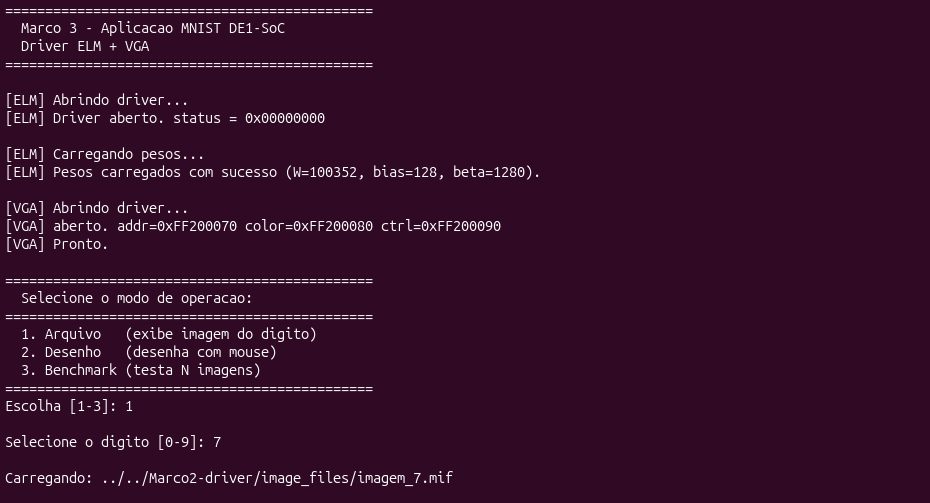
  <br/>
  <em>Inicialização: carregamento dos pesos ELM e menu interativo</em>
</p>

---

## Modo 1 — Arquivo (`modo_arquivo.c`)

Lê uma imagem `.mif` do dataset MNIST, exibe no VGA e classifica.

```bash
sudo ./app --modo arquivo --img ../../Marco2-driver/image_files/imagem_7.mif -e 7
```

**Fluxo de chamadas:**

```
main.c
  └─► modo_arquivo(elm, vga, cfg)
        ├─► elm_mif_load_image()        — lê .mif → uint8_t[784]
        ├─► vga_draw_image()            — exibe no monitor VGA pixel a pixel
        │     └─► vga_set_pixel() ×784  — escreve addr+cor nos PIOs, polling DONE
        ├─► elm_reset()          [Marco 2] — zera FSM e acumuladores (PIO ctrl)
        └─► elm_classify()       [Marco 2] — envia imagem e obtém predição
              ├─► elm_load_image()      — 784 instruções STORE_IMG via elm_exec.S
              └─► elm_start()           — instrução START → co-processador executa ELM
                    └─► data_out[3:0]   — dígito predito retornado pela FPGA (Marco 1)
```

<p align="center">
  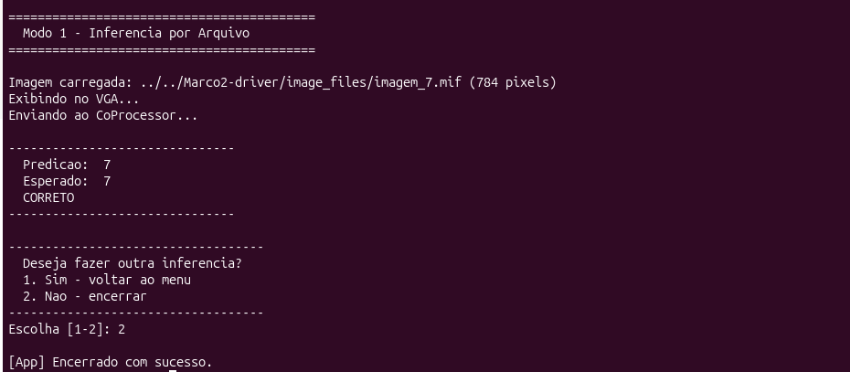
  <br/>
  <em>Modo 1: dígito 7 classificado corretamente — Predição: 7 / Esperado: 7 / CORRETO</em>
</p>

---

## Modo 2 — Desenho com Mouse (`modo_desenho.c`)

O usuário desenha no canvas 28×28 exibido em escala 10× no monitor (280×280 px centralizado em 640×480). Um cursor em cruz vermelha indica a posição atual sobre o fundo preto.

```bash
sudo ./app --modo desenho
```

**Controles:**

| Botão | Evento Linux | Ação |
|-------|-------------|------|
| Esquerdo | `BTN_LEFT` | Pinta pixel branco + 4 vizinhos |
| Meio | `BTN_MIDDLE` | Apaga pixel + 4 vizinhos |
| Direito | `BTN_RIGHT` | Confirma e classifica |

**Fluxo de chamadas:**

```
main.c
  └─► modo_desenho(elm, vga, cfg)
        ├─► mouse_open()               — abre /dev/input/event0 (O_NONBLOCK)
        ├─► vga_clear()                — apaga canvas no VGA
        └─► loop de captura
              ├─► mouse_poll()         — lê EV_REL (movimento) e EV_KEY (botões)
              ├─► mouse_canvas_xy()    — converte posição VGA → canvas 28×28
              │     cx = (vga_x - 180) / 10
              │     cy = (vga_y - 100) / 10
              ├─► paint_pixel()        — BTN_LEFT: canvas[idx]=255, VGA_WHITE
              ├─► erase_pixel()        — BTN_MIDDLE: canvas[idx]=0, VGA_BLACK
              ├─► cursor_draw()        — VGA_RED nos 5 pixels da cruz
              └─► BTN_RIGHT: confirma
                    ├─► elm_reset()    [Marco 2] — zera FSM do co-processador
                    └─► elm_classify() [Marco 2] — envia canvas[784] ao co-processador
```

A escala 10× existe **apenas para exibição** no `ghrd_top.v` — o co-processador sempre recebe o array 28×28 original sem transformação.

<p align="center">
  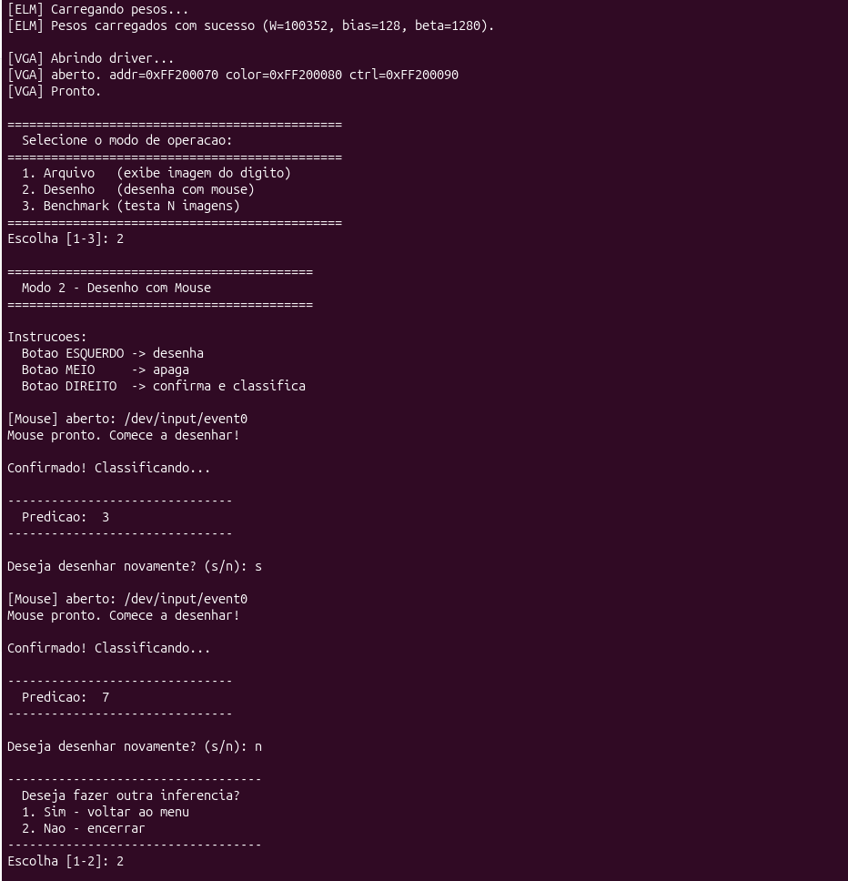
  <br/>
  <em>Modo 2: dois desenhos consecutivos — dígitos 3 e 7 classificados corretamente</em>
</p>

### Dígitos Desenhados no Canvas VGA (0–9)

Cada imagem mostra o canvas 28×28 em escala 10× no monitor VGA. Traço branco, fundo preto, cursor vermelho em cruz.

| 0 | 1 | 2 | 3 | 4 |
|:-:|:-:|:-:|:-:|:-:|
| 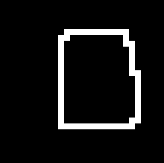 | 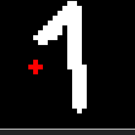 | 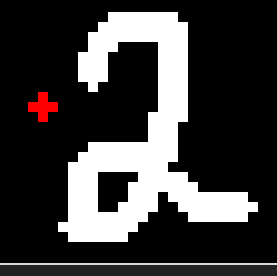 | 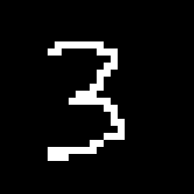 | 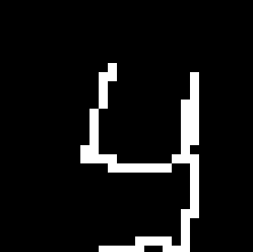 |

| 5 | 6 | 7 | 8 | 9 |
|:-:|:-:|:-:|:-:|:-:|
| 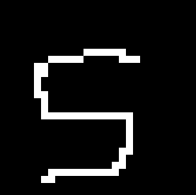 | 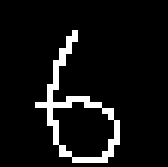 | 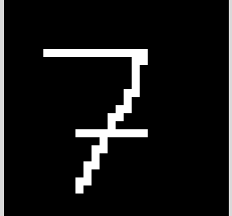 | 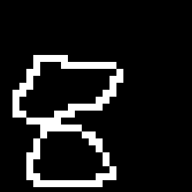 | 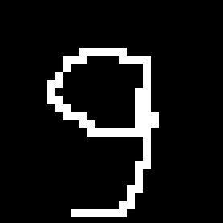 |

> **Análise de desempenho por dígito:** dígitos com traço simples e contínuo (1, 7) são classificados com maior precisão. Dígitos com curvas fechadas (0, 6, 8, 9) ou bifurcações (4, 5) são mais sensíveis à espessura e posição do traço. Traços muito finos ou próximos às bordas do canvas 28×28 reduzem a acurácia, pois o modelo foi treinado com imagens MNIST centralizadas com margem.

---

## Modo 3 — Benchmark (`modo_benchmark.c`)

Lê imagens PNG diretamente via `stb_image`, sem pré-conversão. Testa um dígito por execução com offset configurável para garantir conjuntos sem repetição entre execuções.

```bash
sudo ./app --modo benchmark \
  --dir ../../Marco2-driver/image_files/test \
  --e 7 --n 100 --offset 0 --log resultado_d7.log
```

**Fluxo de chamadas:**

```
main.c
  └─► modo_benchmark(elm, vga, cfg)
        ├─► listar_pngs()              — opendir/readdir + qsort (ordem alfabética)
        └─► para cada imagem [offset .. offset+N]:
              ├─► carregar_png()       — stb_image: PNG → uint8_t[784] grayscale
              ├─► vga_draw_image()     — exibe no monitor durante a inferência
              ├─► elm_reset()  [Marco 2] — zera FSM antes de cada inferência
              ├─► clock_gettime(CLOCK_MONOTONIC, &t0)
              ├─► elm_classify()[Marco 2] — inferência no co-processador (Marco 1)
              ├─► clock_gettime(CLOCK_MONOTONIC, &t1)
              └─► grava CSV: índice, arquivo, esperado, predito, correto, latência
```

**Offset determinístico:**

```
offset=0   → imagens [0 .. N-1]
offset=100 → imagens [100 .. 100+N-1]
```

**Métricas calculadas:**

| Métrica | Fórmula |
|---------|---------|
| Acurácia | `(acertos / total) × 100%` |
| Latência média | `Σ latᵢ / n` |
| Desvio padrão | `√( Σ(latᵢ − média)² / n )` |
| Mínima / Máxima | `min(latᵢ)` / `max(latᵢ)` |
| Throughput | `1000 / média  [img/s]` |

> A latência mede exclusivamente `elm_classify()`, excluindo exibição VGA e I/O de arquivo.

<p align="center">
  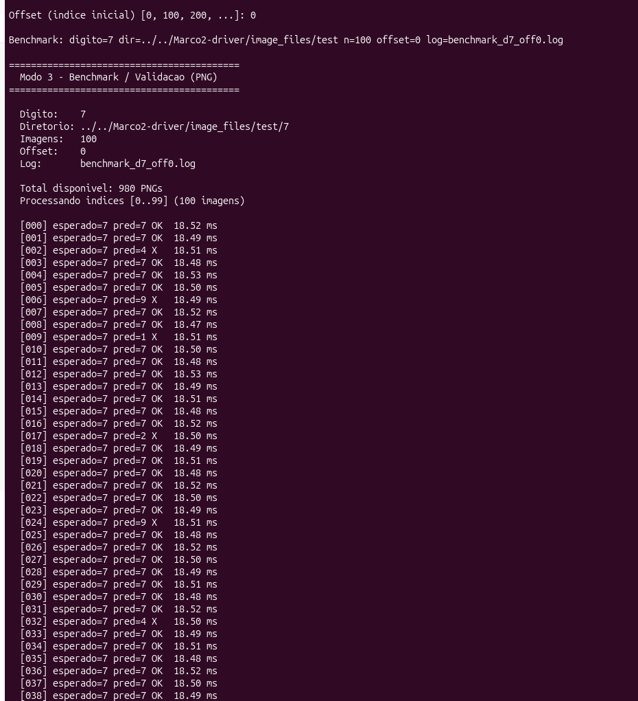
  <br/>
  <em>Modo 3: execução do benchmark para o dígito 7 — 100 imagens, índices [0..99]</em>
</p>

<p align="center">
  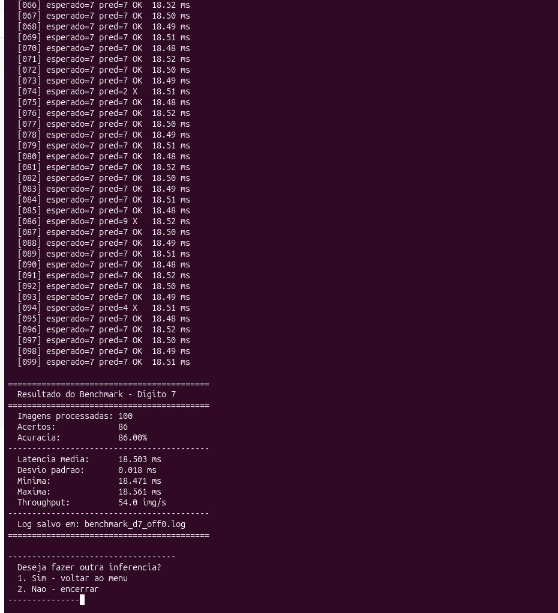
  <br/>
  <em>Resultado final: 86 acertos em 100 imagens — acurácia 86%, latência média 18.503 ms, throughput 54.0 img/s</em>
</p>

### Log de Saída

O benchmark gera automaticamente um arquivo `.log` com nome `benchmark_d<digito>_off<offset>.log`. O arquivo contém duas partes:

**CSV por inferência** — uma linha por imagem processada:

```
indice,arquivo,esperado,predito,correto,latencia_ms
0,test/7/0001.png,7,7,1,18.5200
1,test/7/0002.png,7,7,1,18.4900
2,test/7/0003.png,7,4,0,18.5100
...
```

**Resumo final** — métricas agregadas ao final do arquivo:

```
# === Resumo ===
# digito: 7
# imagens_processadas: 100
# acertos: 86
# acuracia_pct: 86.00
# latencia_media_ms: 18.503
# desvio_padrao_ms: 0.018
# latencia_min_ms: 18.471
# latencia_max_ms: 18.561
# throughput_img_s: 54.0
```

> ⚠️ **Observação — Escopo atual do log:** o arquivo de log salva exclusivamente os resultados das inferências do modo benchmark. Para que o log cumpra plenamente sua função de rastreabilidade do sistema, ele deve ser expandido para registrar eventos de todos os modos, incluindo: timestamp (data e hora) de cada operação, eventos de mouse (cliques, movimentos e confirmações no modo desenho), arquivos `.mif` e PNG enviados ao co-processador, modo selecionado pelo usuário, inicialização dos drivers ELM e VGA, e erros em tempo de execução. Esta expansão é necessária para auditoria completa do comportamento do sistema embarcado.

---

## Compilação e Execução

```bash
# 1. Gravar o .sof na placa (necessario apos cada religamento)
cd elm_hps_project
quartus_pgm -m jtag -o "p;output_files/soc_system.sof"

# 2. Compilar Marco 2 na placa (apenas na primeira vez)
cd Marco2-driver
sed -i 's/-std=c11/-std=gnu99/' Makefile
make libelm.a

# 3. Compilar e rodar o Marco 3
cd Marco3-API/files
make clean && make
chmod +x app
sudo ./app
```

> O FPGA perde a configuração ao desligar — o `.sof` deve ser regravado a cada sessão.

---

## Estrutura

```
Marco3-API/files/
├── main.c              # Orquestrador: inicializa ELM, VGA, loop de modos
├── app.h               # Tipos e constantes compartilhados
├── modo_arquivo.c      # Modo 1: inferência por arquivo .mif
├── modo_desenho.c      # Modo 2: canvas com mouse + cursor VGA em cruz
├── modo_benchmark.c    # Modo 3: benchmark PNG com métricas completas
├── vga.c / vga.h       # Driver VGA via PIOs MMIO (/dev/mem)
├── mouse.c / mouse.h   # Driver mouse via /dev/input/event0
├── stb_image.h         # Leitura de PNG (single-header, nothings/stb)
├── stb_image_impl.c    # Compilação única da implementação stb
└── Makefile
```

---

<p align="center">
  <a href="MARCO2.md">← Marco 2</a> &nbsp;|&nbsp; <a href="README.md">Início</a>
</p>