# Classificação de Dígitos MNIST em FPGA: Marco 1 
Co-processador ELM 


## Sumário

1. [Descrição do Projeto](#descrição-do-projeto)
2. [Fluxo de Inferência](#fluxo-de-inferência)
3. [Representação Númérica](#representação-numérica--ponto-fixo-q412)
4. [Estrutura do Repositório](#📁-estrutura-do-repositório)
6. [Máquina de Estado (FSM)](#máquina-de-estados-fsm)
7. [Objetivo do Marco 1](#objetivo-do-marco-1)
8. [Hardware Utilizado](#hardware-utilizado)
9. [Interface com a placa DE1-SoC](#interface-com-a-placa-de1-soc)
10. [Softwares Utilizados](#softwares-utilizados)
11. [Instalação e Configuração do Ambiente](#instalação-e-configuração-do-ambiente)
12. [Execução dos Testes de Simulação](#execução-dos-testes-de-simulação)
13. [Resultados dos Testes](#resultados-dos-testes)
14. [Recursos FPGA Utilizados](#recursos-fpga-utilizados)
15. [Análise dos Resultados](#análise-dos-resultados)
16. [Equipe](#equipe)
17. [Referências](#referências)
---
### Descrição do Projeto
Este projeto implementa um classificador de dígitos MNIST em hardware reconfigurável (FPGA), utilizando uma rede neural do tipo Extreme Learning Machine (ELM). Toda a inferência — da leitura da imagem até a predição do dígito — ocorre diretamente no chip, sem auxílio de CPU.


### Por que ELM?

A ELM foi escolhida por três razões principais:

- **Estrutura simples**: camada oculta com pesos aleatórios fixos e somente a camada de saída é treinada, o que dispensa retropropagação em hardware
- **Baixa latência**: número reduzido de operações por inferência em comparação a CNNs
- **Adequada para ponto fixo**: operações lineares e função de ativação simples mapeiam bem em Q4.12

### Fluxo de Inferência
A ELM opera em quatro estágios sequenciais:


```
┌─────────────┐     ┌──────────┐     ┌────────────┐     ┌──────────┐     ┌──────────────┐
│  Imagem     │     │  Memória │     │  MAC Unit  │     │ Ativação │     │   Argmax     │
│  28×28 px   │────▶│  W_in/β  │────▶│  (Q4.12)   │────▶│ Sigmoid  │────▶│  Saída 0–9   │
│  (784 bytes)│     │  bias    │     │            │     │  (LUT)   │     │              │
└─────────────┘     └──────────┘     └────────────┘     └──────────┘     └──────────────┘
                                            ▲
                                     ┌──────────────┐
                                     │  FSM Control │
                                     │  (elm_fsm)   │
                                     └──────────────┘
```

### Representação Numérica  Ponto Fixo Q4.12

```
 Bit 15   Bit 14–12    Bit 11–0
┌───────┬────────────┬─────────────────────────────┐
│ Sinal │   Inteiro  │        Fração (1/4096)      │
│  (1b) │    (3b)    │           (12b)             │
└───────┴────────────┴─────────────────────────────┘

  Faixa: -8.0 até +7.9997...
  Resolução: ≈ 0.000244
```

> 💡 Para converter um valor real `v` para Q4.12: `int(v * 4096)` em Python.


| Parâmetro | Dimensão      | Arquivo de inicialização |
|-----------|---------------|--------------------------|
| `W_in`    | 128 × 784     | `W_in_q.mif`             |
| `b`       | 128 × 1       | `b_q.mif`                |
| `β`       | 10 × 128      | `beta_q.mif`             |
| `x`       | 784 × 1       | `png.mif`                |

Todos os valores são representados em **ponto fixo Q4.12** (1 bit de sinal + 3 bits inteiros + 12 bits fracionários, resolução ≈ 0,000244).

---

## 📁 Estrutura do Repositório

```bash
.
├── elm_accel/               # Módulos RTL principais
│   ├── elm_accel_core.v     # Coordena MAC, memória e ativação
│   ├── mac.v                # Unidade Multiplica-Acumula (Q4.12)
│   ├── fsm.v                # Controlador de estados da inferência
│   ├── tanh_lut.v           # Controlador de estados da inferência
│   ├── argmax.v             # Controlador de estados da inferência
│   └── ram_image.qip        # Instância da memória RAM-1-Port (Word:7841 16:bits)
│   ├── ram_w_in.qip         # Instância da memória RAM-1-Port (Word:100352 16:bits)
│   ├── ram_bias.qip         # Instância da memória RAM-1-Port (Word:128 16:bits)
│   ├── ram_beta.qip         # Instância da memória RAM-1-Port (Word:7841 16:bits)
│   ├── ram_h.qip.v          # Instância da memória RAM-1-Port (Word:128 16:bits)
├── sim/                     # Arquivos de simulação
│   └── elm_accel_tb.v       # Testbench com imagens MNIST
│
├── state_management/        # Controle e monitoramento de estado
│
│
├── scripts/
│   └── run_all              # Executa no terminal do Questa todos os testbench simultaneamente 
│
├── gitimages/               # Diretórios específicos para imagens do projeto
│   ├── mnist_png            # Imagens MNIST de teste (.png)
│   ├── testbench            # Simulação dos testbench no Questa
├── docs/                    # Diagramas, prints e documentação
└── README.md
```

#### Dependências entre Módulos

```
elm_top (top-level)
├── fsm.v          ──▶ controla sinais de enable/reset
├── datapath.v
│   ├── mac.v      ──▶ operação de produto escalar Q4.12
│   └── memory.v   ──▶ fornece pesos e pixels ao MAC
```

#### Descrição dos Módulos

| Arquivo              | Módulo       | Responsabilidade                                      |
|----------------------|--------------|-------------------------------------------------------|
| `elm_accel/elm_accel.v`| `elm_accel` | Top-level orquestra o fluxo de dados entre MAC e memória        |
| `elm_accel/mac.v`    | `mac`        | Multiplica dois operandos Q4.12 e acumula resultado   |
| `elm_accel/tanh_lut.v`| `tanh_lut`   | Aplica a função piecewise   |
| `elm_accel/display_7seg.v`| `display_7seg`    | Exibe o dígito resultado da inferência  |
| `elm_accel/fsm.v`    | `elm_fsm`    | Gera sinais de controle conforme estado atual         |
| `elm_accel/memories.v` | `memories`     | ROM/RAM para imagem, pesos W_in, bias e β            |
| `sim/elm_accel_tb_real.v`    | `elm_accel_tb_real`         | Aplica os testes de todos os módulos            |

---

### Arquitura do Co-processador (RTL Viewer Quartus)

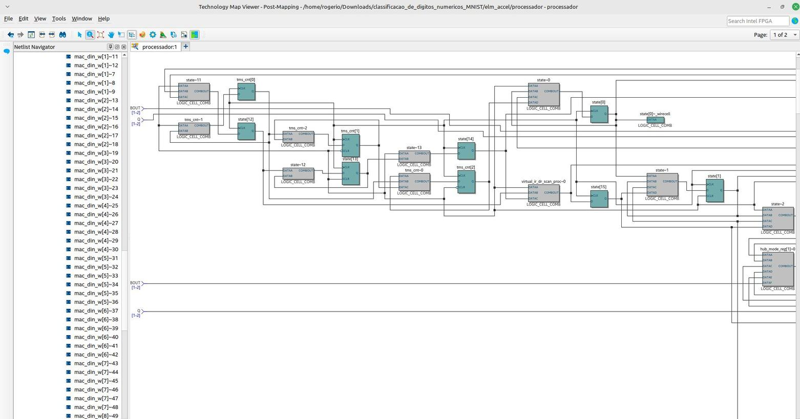
<!-- Exportar via Tools > Netlist Viewers > RTL Viewer -->
<table>
  <tr>
    <td align="center" width="50%">
      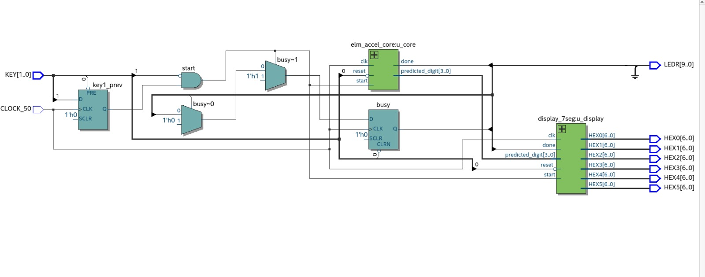
      <br/>
      <sub><b>🏗️ Diagrama de Arquitetura Geral</b></sub>
    </td>
    <td align="center" width="50%">
      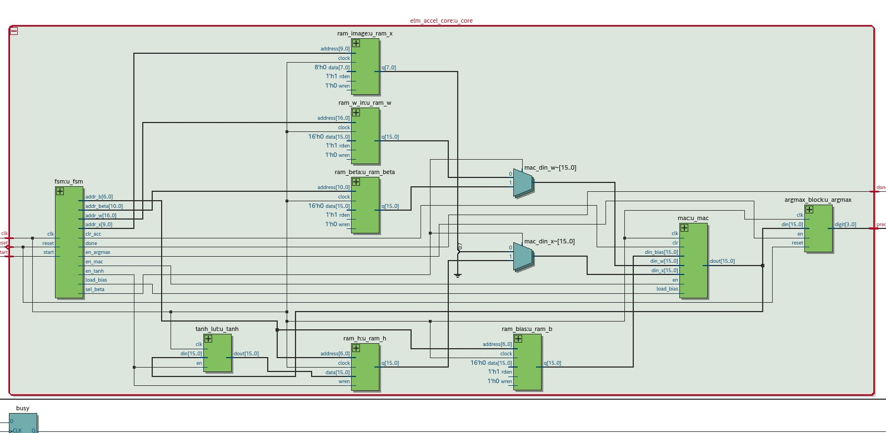
      <br/>
      <sub><b>⚙️ Core do Módulo elm_accel</b></sub>
    </td>
  </tr>
</table>


### Máquina de Estados (FSM)
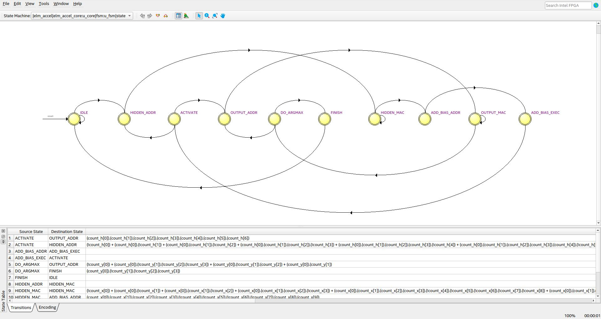

> **Diagrama gerado automaticamente pelo Quartus State Machine Viewer.** 

#### Tabela de Estados

| Estado           | Descrição                                        | Transição          |
|------------------|--------------------------------------------------|--------------------|
| `IDLE`           | Aguarda sinal `start`                            | `start=1` → `LOAD` |
| `LOAD`           | Transfere os 784 pixels para a memória interna   | Contador cheio → `COMPUTE_HIDDEN` |
| `COMPUTE_HIDDEN` | Executa operações MAC: `h = W_in · x + b`        | MAC completo → `ACTIVATE` |
| `ACTIVATE`       | Aplica piecewise via LUT sobre cada nó oculto    | LUT completa → `COMPUTE_OUTPUT` |
| `COMPUTE_OUTPUT` | Calcula saída: `y = β · h`                       | MAC completo → `ARGMAX` |
| `ARGMAX`         | Encontra índice do maior valor em `y[0..9]`      | Seleção pronta → `DONE` |
| `DONE`           | Mantém resultado; aguarda reset ou novo `start`  | `rst=1` → `IDLE`  |

---

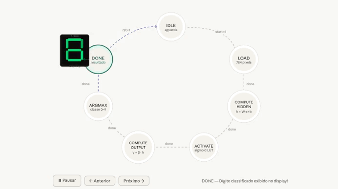


### Objetivo do Marco 1

> Construir e validar o núcleo de inferência ELM em FPGA por meio de **simulação funcional** no ModelSim/QuestaSim.

### Hardware Utilizado 

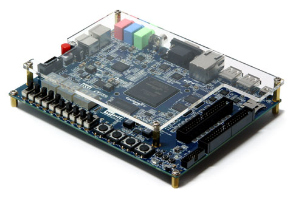

| Pino       | Função                                      |
|------------|---------------------------------------------|
| `KEY[0]`   | Reset assíncrono (ativo baixo)              |
| `KEY[1]`   | Start — dispara inferência (borda de descida) |
| `HEX0`     | Dígito predito (0–9)                        |
| `LEDR[0]`  | Done — acende ao concluir a inferência      |
| `LEDR[9]`  | Busy — acende durante o processamento       |

---

## Interface com a placa DE1-SoC

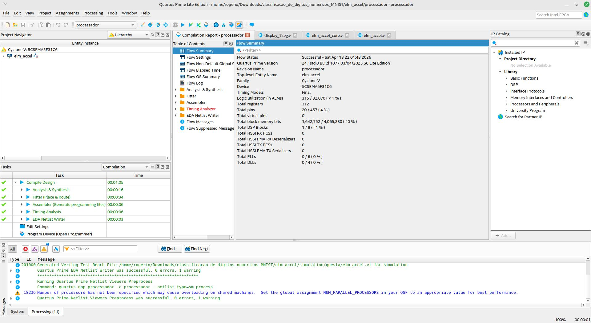

---

| Item                  | Especificação                              |
|-----------------------|--------------------------------------------|
| Placa de desenvolvimento | DE1-SoC — Terasic                       |
| FPGA                  | Intel Cyclone V — 5CSEMA5F31C6             |
| Elementos lógicos     | 315 ALMs                                   |
| Blocos de memória     | 1.642.752 bits (M10K)                      |
|Total Registradores    | 312                                        |
| Blocos DSP            | 86 disponíveis                             |
| Clock                 | 50 MHz (CLOCK_50)                          |
| Interface de usuário  | 2 botões KEY, 10 LEDs LEDR, 1 display HEX0 |


## Softwares Utilizados

| Software                              | Versão          | Finalidade                        |
|---------------------------------------|-----------------|-----------------------------------|
| Intel Quartus Prime Lite Edition      | 24.1std.0.1077  | Síntese, place & route, programação FPGA |
| Questa Intel Starter FPGA Edition-64  | 2024.3          | Simulação funcional RTL           |
| Python 3                              | 3.10+           | Conversão PNG → Q4.12 (.hex/.mif) |
| Pillow (PIL)                          | —               | Leitura de imagens PNG            |
| NumPy                                 | 1.24+           | Operações de normalização Q4.12   |
| Git                                   | —               | Controle de versão                |

---

> ⚠️ Versões diferentes do Quartus podem apresentar divergências no relatório de timing. Recomenda-se usar a **24.1 Lite** para reprodução fiel dos resultados.

---

## Instalação e Configuração do Ambiente


#### 1. Clonar o repositório

```bash
git clone <https://github.com/rogeriocerqueira/classificacao_de_digitos_numericos_MNIST>
cd classificacao_de_digitos_numericos_MNIST
```

#### 2. Gerar os arquivos `.hex` e `.mif` das imagens

Coloque as imagens MNIST (28×28 PNG) em uma pasta e execute:

---
#### Instalação das dependências Python

```bash
sudo apt install python3-pil python3-numpy
```

---


```bash
python3 /caminho_para_script/convert_images.py
```

O script gera automaticamente:
- `sim/0.hex` a `sim/9.hex` — para simulação no Questa
- `elm_accel/0.mif` a `elm_accel/9.mif` — para síntese no Quartus

Para selecionar qual dígito testar:

```bash
# Simulação
cp sim/7.hex sim/png.hex

# Síntese (requer recompilação no Quartus)
cp elm_accel/7.mif elm_accel/png.mif
```

#### 3. Compilar no Quartus

```
1. Abrir elm_accel/processador.qpf no Quartus
2. Processing → Start Compilation
3. Aguardar compilação (~5-10 minutos)
```

#### 4. Programar a DE1-SoC

```
1. Conectar USB-Blaster
2. Tools → Programmer
3. Selecionar output_files/processador.sof
4. Start
```

#### 5. Operar na placa

```
KEY[0] → Reset (mantém pressionado e solta para iniciar)
KEY[1] → Pressionar para disparar a inferência
LEDR[9] acende → processando (~2ms a 50 MHz)
LEDR[0] acende → inferência concluída
HEX0 → exibe o dígito predito (0–9)
```

---

### Execução dos Testes de Simulação

#### Pré-requisito

Garantir que os arquivos `.hex` estejam na pasta `sim/`:

```bash
cd sim/
cp 0.hex png.hex    # ou qualquer dígito desejado
wc -l png.hex       # deve mostrar 784
```

#### Rodar todos os testbenches

No transcript do Questa:

```tcl
Questa> cd /caminho/para/sim
Questa> do run_all.do
```

O script executa automaticamente na ordem:

```
1. mac_tb          — 5 testes unitários do MAC
2. tanh_lut_tb     — 7 casos da ativação
3. argmax_block_tb — 4 testes do argmax
4. fsm_tb          — 11 testes da FSM
5. elm_accel_tb    — 12 testes de integração
6. elm_accel_tb_real — inferência com pesos reais
```

#### Trocar imagem e re-testar

```bash
cp 3.hex png.hex    # testar dígito 3
```

```tcl
Questa> do run_all.do
```

---
#### Etapa de Testbench

### Script `run_all.do` — Compilação completa

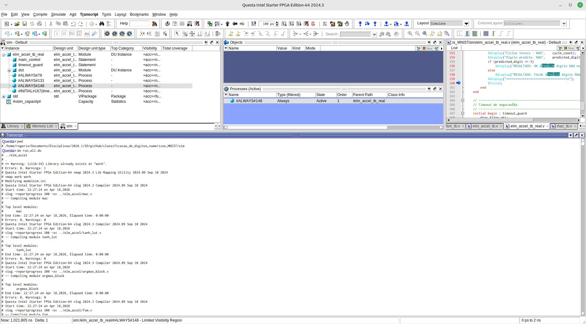

Compilação de todos os módulos RTL e testbenches sem erros. A ordem de compilação garante que as dependências sejam resolvidas corretamente. 


#### Teste do MAC Q4.12

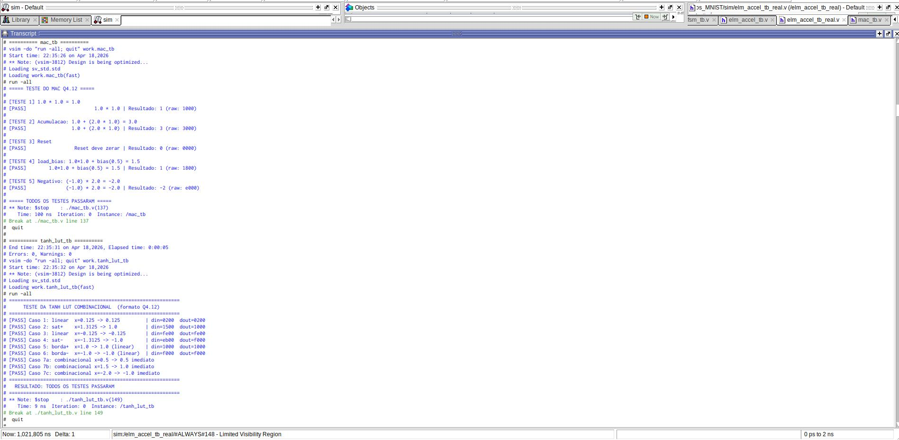

Todos os 5 testes do MAC passaram:

| Teste | Operação | Resultado raw | Valor Q4.12 |
|-------|----------|---------------|-------------|
| 1 | `1.0 × 1.0` | `0x1000` | +1.0  |
| 2 | `1.0 + (2.0 × 1.0)` | `0x3000` | +3.0  |
| 3 | Reset (`clr=1`) | `0x0000` | 0.0  |
| 4 | `1.0×1.0 + bias(0.5)` | `0x1800` | +1.5  |
| 5 | `(-1.0) × 2.0` | `0xE000` | -2.0 |

O MAC mantém o acumulador em Q8.24 internamente (`acc[31:0]`) e fatia `acc[27:12]` na saída preservando precisão durante as 784 acumulações sem truncamento intermediário.

Todos os 7 casos do `tanh_lut` passaram, confirmando o comportamento combinacional correto nas três regiões: saturação positiva, linear e saturação negativa.

---

#### Teste do argmax_block

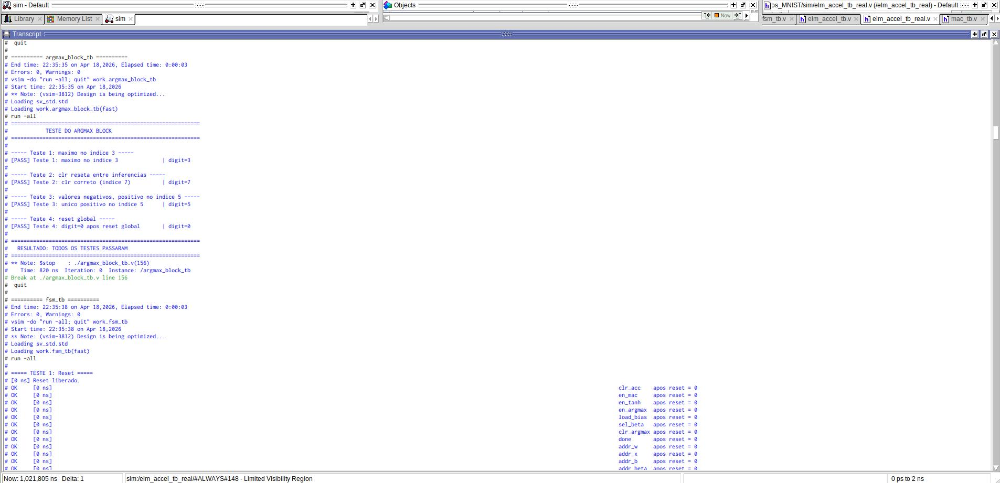
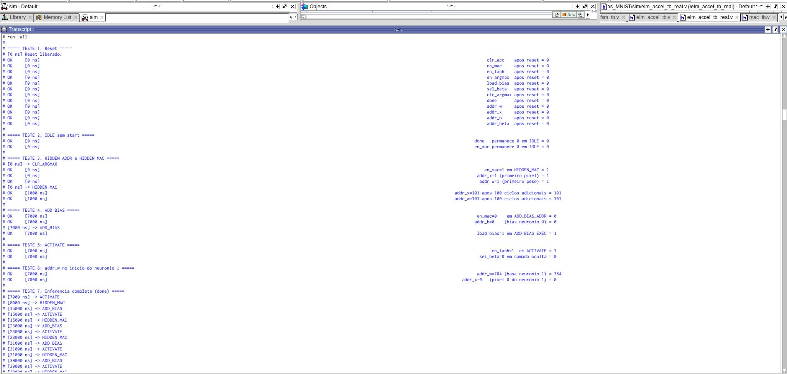
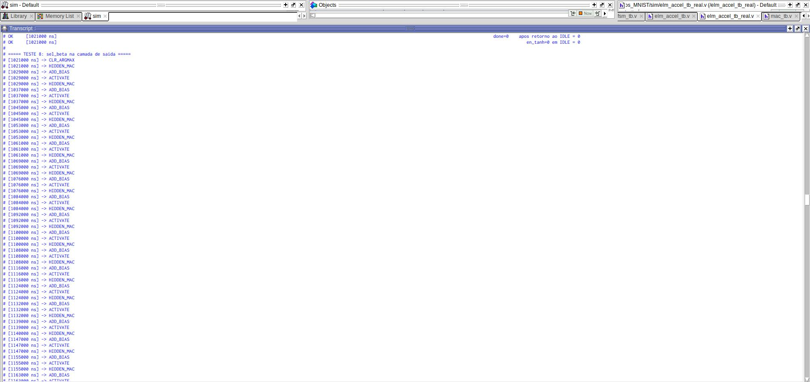
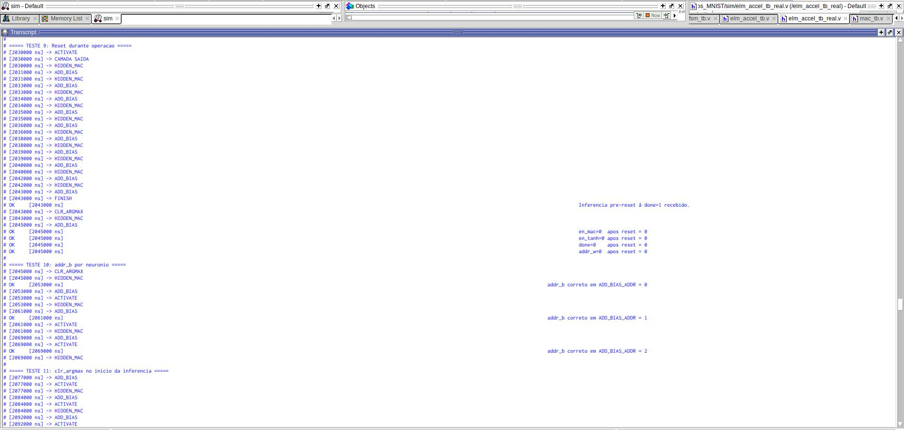

| Teste | Cenário | Resultado |
|-------|---------|-----------|
| 1 | Máximo no índice 3 (`0x7000`) | `digit=3`  |
| 2 | `clr` reseta entre inferências | `digit=7`  |
| 3 | Único positivo no índice 5 | `digit=5`  |
| 4 | Reset global | `digit=0`  |

O **Teste 2** é o mais crítico. Ele valida a correção do Bug #4. Sem o sinal `clr_argmax`, `max_val` da inferência anterior (`0x7000`) persistiria, impedindo qualquer atualização na inferência seguinte.

---

#### Testes de integração — elm_accel_tb

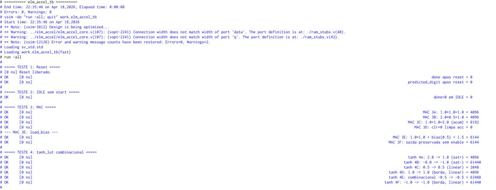
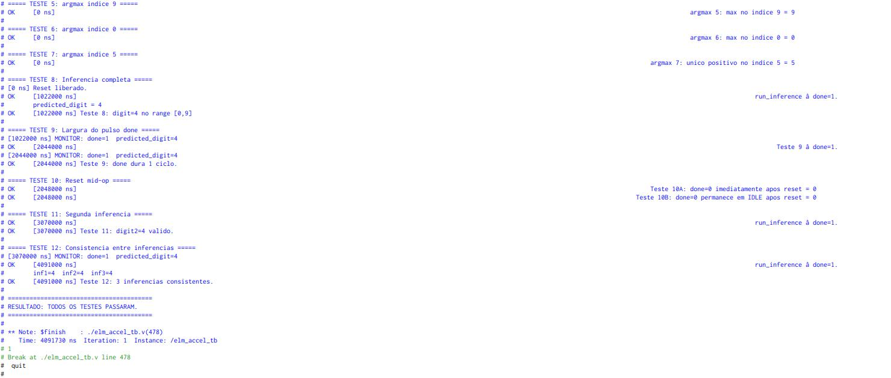

Todos os **12 testes de integração** passaram:

| Teste | Descrição | Resultado |
|-------|-----------|-----------|
| 1 | Reset — sinais inicializados | sim |
| 2 | IDLE sem start | sim  |
| 3 | MAC isolado (6 sub-testes) | sim |
| 4 | tanh_lut combinacional (6 sub-testes) | sim |
| 5 | argmax — máximo no índice 9 | sim |
| 6 | argmax — máximo no índice 0 | sim |
| 7 | argmax — único positivo no índice 5 | sim |
| 8 | Inferência completa | `digit=4` sim |
| 9 | Pulso `done` dura 1 ciclo | sim |
| 10 | Reset durante inferência | sim |
| 11 | Segunda inferência após reset | `digit=4` sim |
| 12 | Consistência — 3 inferências | `inf1=4, inf2=4, inf3=4` sim |

O **Teste 12** valida simultaneamente os quatro bugs corrigidos: três inferências consecutivas retornam sempre o mesmo dígito, provando que `max_val` é resetado corretamente entre execuções.

---

#### Inferência com pesos reais — elm_accel_tb_real

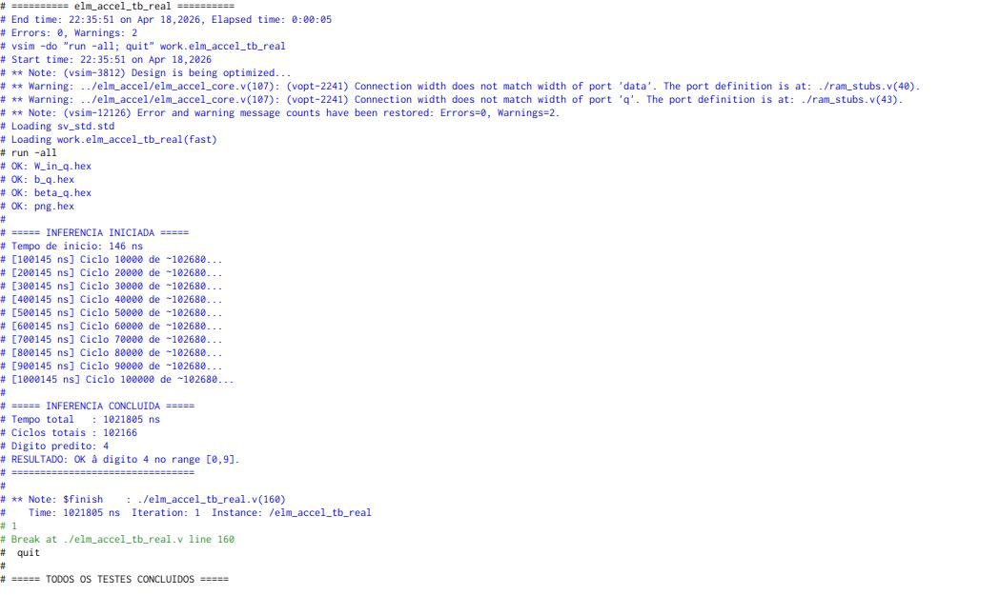

```
Arquivos verificados:  W_in_q.hex ✓  b_q.hex ✓  beta_q.hex ✓  png.hex ✓

INFERENCIA CONCLUIDA
  Tempo total   : 1.021.805 ns
  Ciclos totais : 102.166
  Dígito predito: 4
  RESULTADO: OK — dígito 4 no range [0,9]
```

**Ciclos medidos vs esperados:**

| Componente | Cálculo | Ciclos |
|---|---|---|
| Camada oculta | 128 × 788 | 100.864 |
| Camada de saída | 10 × 130 | 1.300 |
| FINISH | 1 | 1 |
| **Total teórico** | | **102.165** |
| **Total medido** | | **102.166** |

Diferença de 1 ciclo dentro do pipeline da FSM dentro do esperado.

---

### Recursos FPGA Utilizados

Dados do **Fitter RAM Summary** após síntese no Quartus:

| RAM | Profundidade | Largura | Bits | Tipo |
|-----|-------------|---------|------|------|
| `ram_w_in` | 100.352 | 16-bit | 1.605.632 | M10K Single Port |
| `ram_beta` | 1.280 | 16-bit | 20.480 | M10K Single Port |
| `ram_bias` | 128 | 16-bit | 2.048 | M10K Single Port |
| `ram_h` | 128 | 16-bit | 2.048 | M10K Auto |
| `ram_image` | 784 | 16-bit | 12.544 | M10K Dual Port |
| **Total** | | | **1.642.752** | |

**Resumo de recursos lógicos:**

| Recurso | Utilizado | Disponível | Percentual |
|---------|-----------|------------|------------|
| ALMs (lógica) | 315 | 32.070 | < 1% |
| Registradores | 306 | — | — |
| Block memory bits | 1.642.752 | 4.065.280 | 40% |
| DSP Blocks | 1 | 87 | 1% |
| Pinos | 55 | 457 | 12% |

A memória `ram_w_in` domina com **97,7% dos bits de memória** consequência direta da dimensão 128×784 da matriz de pesos. A lógica de controle (FSM + MAC + argmax) é ocupando menos de 1% dos ALMs disponíveis.

---

### Análise dos Resultados

#### Pontos fortes

- **Arquitetura modular:** separação clara entre controle (FSM) e dados (MAC, tanh, argmax), facilitando depuração e reutilização
- **Ponto fixo Q4.12:** resolução adequada para os pesos ELM sem necessidade de ponto flutuante — 0 DSPs extras
- **Acumulador Q8.24:** evita perda de precisão durante 784 multiplicações sequenciais
- **Testbenches em camadas:** validação progressiva de unitário a sistema completo, com 35+ casos de teste
- **Correção de 4 bugs críticos** identificados por análise estática do código antes da simulação

#### Limitações conhecidas

- **Hard tanh ≠ tanh real:** a aproximação `clip(x,−1,1)` introduz erro máximo de ~31% nas bordas `x ≈ ±1`. O impacto na acurácia depende da distribuição das ativações do modelo
- **Overflow silencioso no MAC:** `acc[31:28]` é descartado sem tratamento, acumulações muito grandes podem resultar em saturação não detectada
- **Imagem fixa no Marco 1:** troca de imagem requer recompilação no Quartus. Resolvido no Marco 2 via MMIO pelo driver Linux
- **Sem debounce em KEY[1]:** múltiplos pulsos de `start` possíveis em acionamento rápido na placa física

### Desempenho

| Métrica | Valor |
|---------|-------|
| Ciclos por inferência | 102.166 |
| Tempo a 50 MHz (placa) | ~2,04 ms |
| Throughput estimado | ~490 inferências/segundo |
| Operações MAC totais | 101.632 |
| Ocupação de memória | 40% dos M10K |
| Ocupação de lógica | < 1% dos ALMs |

### Timing por Fase de Inferência Questa

```
Ciclos de clock por fase (estimativa):

LOAD            █████████████████████████  784 ciclos
COMPUTE_HIDDEN  ████████████████████████████████████████████  N×784 ciclos
ACTIVATE        ████  N ciclos
COMPUTE_OUTPUT  ████████  N×10 ciclos
ARGMAX          █  10 ciclos

Total estimado: depende do número de neurônios ocultos N
```
### Acurácia por Dígito

| Dígito | Total testado | Correto | Acurácia |
|--------|---------|---------------|----------|
| 0      |    10    |         10      | 100%  |
| 1      |    10    |          0     | 0%     |
| 2      |    10    |          1     | 1%    |
| 3      |    10    |          0     | x      |
| 4      |    10    |         10     | 100%     |
| 5      |    10    |          0     | 0%     |
| 6      |    10    |          1     | 1%     |
| 7      |    10    |          0     |0 %     |
| 8      |    10    |          0     | x      |
| 9      |    10    |          0     | x      |
| **Total** |  40    |         22       | **20,2%**  |

> *Os únicos valores reconhecidos foram os apresentados na tabela outros valores em x não foram testados.*


### Equipe

| Nome | Papel | GitHub |
|------|-------|--------|
| Rogério Cerqueira| Arquitetura RTL / Verilog | [@rogeriocerqueira](https://github.com/rogeriocerqueira) |
| Jones Barcellar | Treinamento ELM / Geração de pesos | [@jonesBdev](https://github.com/jonesBdev) |
| Ricardo Vilas Boas | Testbench e validação | [@RickVB-FSA](https://github.com/RickVB-FSA) |

> Projeto desenvolvido como trabalho acadêmico  Sistemas Digiatais  Universidade Estadual de Feira de Santana  2026.1

---

### Referências

- HUANG, G.-B. et al. **Extreme Learning Machine: Theory and Applications**. *Neurocomputing*, v. 70, 2006.
- LECUN, Y. et al. **The MNIST Database of Handwritten Digits**. Disponível em: [yann.lecun.com/exdb/mnist](http://yann.lecun.com/exdb/mnist/)
- Intel. **Quartus Prime Lite Edition  User Guide**. Disponível em: [intel.com/quartus](https://www.intel.com/content/www/us/en/products/details/fpga/development-tools/quartus-prime.html)
- IEEE. **Verilog HDL Standard  IEEE Std 1364-2001**.
- Material de apoio da disciplina  [inserir referência da disciplina]

---

<p align="center">
  Desenvolvido em Verilog · Simulado no Questa Intel Starter FPGA · Sintetizado no Quartus Prime  Lite Edition 24.1
</p>
