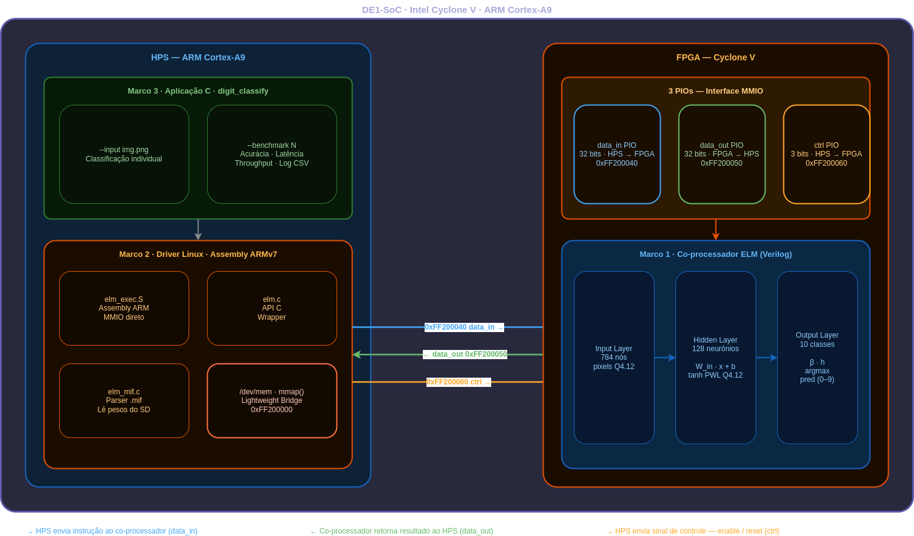

# Classificação de Dígitos MNIST em FPGA
Driver Assembly ARMv7 · Co-processador ELM · DE1-SoC

<p align="center">
  <a href="MARCO1.md">
    
    
  </a>
  &nbsp;
  <a href="MARCO2.md">
    
    
  </a>
  &nbsp;
  <a href="MARCO3.md">
    
    
  </a>
</p>

---

## Sobre o Projeto

Classificador de dígitos MNIST embarcado em um SoC heterogêneo (ARM + FPGA), desenvolvido na disciplina **TEC 499 — Sistemas Digitais** da Universidade Estadual de Feira de Santana (2026.1).

| Marco | Entrega | Status |
|-------|---------|--------|
| [Marco 1 →](MARCO1.md) | Co-processador ELM (referência externa) | ✅ Concluído |
| [Marco 2 →](MARCO2.md) | Driver Linux em Assembly ARM + integração MMIO | 🔄 Em progresso |
| [Marco 3 →](MARCO3.md) | Aplicação C + benchmark + relatório final | ⏳ Pendente |

---

## Arquitetura Geral



---

## Estrutura do Repositório

```bash
.
├── docs/                         # Documentação e arquivos de apoio
│   ├── gitimages/                # Imagens e diagramas do projeto
│   │   ├── general/              # Diagrama geral da arquitetura
│   │   ├── testbench/            # Capturas das simulações no Questa
│   │   ├── architeture.jpeg
│   │   ├── de1soc.jpg
│   │   ├── fsm-flow.gif
│   │   └── ...
│   ├── images/                   # Imagens MNIST de teste (0–9)
│   ├── scripts/
│   └── sim/                      # Testbenches e arquivos de simulação
├── elm_hps_project/              # Projeto Quartus de integração HPS↔FPGA
├── Marco1-coprocessador/         # Co-processador ELM de referência (DestinyWolf)
│   ├── CoProcessor.v
│   ├── ELM_on_DE1_SoC.v
│   ├── inference_unit/
│   ├── memory_files/
│   └── utils/
├── Marco2-driver/                # Driver Assembly ARMv7 — entrega principal
│   ├── elm_exec.S                # Rotinas Assembly (MMIO)
│   ├── elm.c / elm.h             # Wrapper e API
│   ├── elm_platform.h            # Endereços e constantes da plataforma
│   ├── elm_proto.h               # Protótipos da API
│   ├── marco2_test.c             # Teste de estabilidade
│   ├── run_marco2_test.sh        # Script de automação dos testes
│   ├── Makefile
│   └── README.md
├── output_files/                 # Relatórios de síntese do Quartus
├── platform-designer/            # Projeto Qsys — integração HPS↔FPGA
│   └── elm_system.qsys
├── .gitignore
├── MARCO1.md
├── MARCO2.md
├── MARCO3.md
└── README.md
```

---

## Equipe

| Nome               | Papel                              | GitHub |
|--------------------|------------------------------------|--------|
| Rogério Cerqueira  | Driver Assembly / Integração HPS   | [@rogeriocerqueira](https://github.com/rogeriocerqueira) |
| Jones Barcellar    | Treinamento ELM / Geração de pesos | [@jonesBdev](https://github.com/jonesBdev) |
| Ricardo Vilas Boas | Testes e validação                 | [@RickVB-FSA](https://github.com/RickVB-FSA) |

> Projeto acadêmico — TEC 499 Sistemas Digitais · UEFS · 2026.1

---

## Referências

- HUANG, G.-B. et al. **Extreme Learning Machine: Theory and Applications**. *Neurocomputing*, v. 70, 2006.
- LECUN, Y. et al. **The MNIST Database of Handwritten Digits**. [yann.lecun.com/exdb/mnist](http://yann.lecun.com/exdb/mnist/)
- Intel. **Quartus Prime Lite Edition User Guide**. [intel.com/quartus](https://www.intel.com/content/www/us/en/products/details/fpga/development-tools/quartus-prime.html)
- Terasic. **DE1-SoC User Manual**. [terasic.com](https://www.terasic.com.tw/cgi-bin/page/archive.pl?Language=English&CategoryNo=167&No=836)
- ARM. **ARM Architecture Reference Manual ARMv7-A and ARMv7-R edition**. ARM DDI 0406C.
- DestinyWolf. **Problema_SD_2026_1**. [github.com/DestinyWolf/Problema_SD_2026_1](https://github.com/DestinyWolf/Problema_SD_2026_1/tree/master)